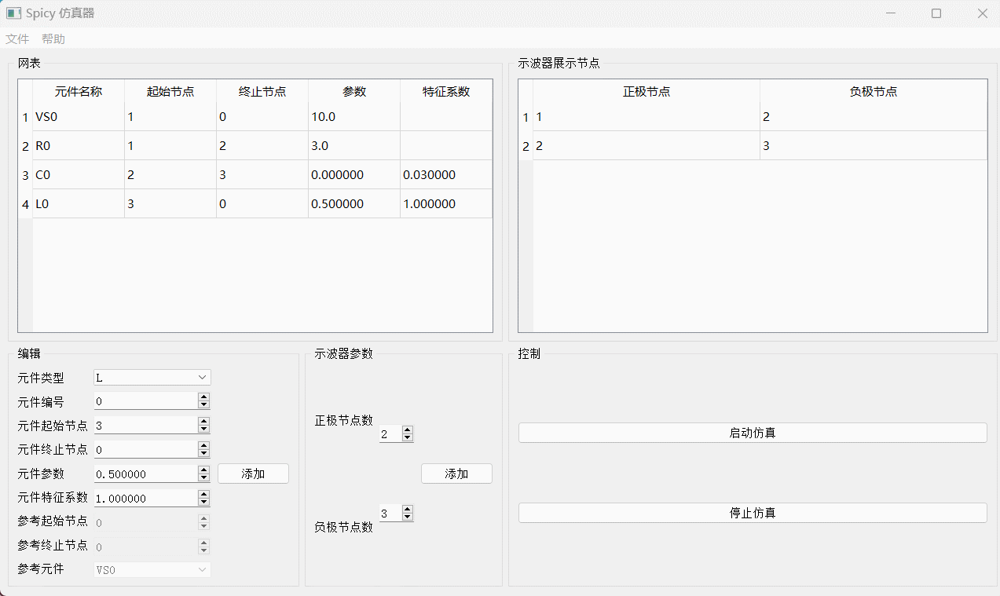

# Spicy

A SPICE-like transient circuit simulator.

It is the course project for Circuits (ELEC321104). As the leader of a two-person team,
I got the highest mark on project.

Team Member: Chenyang LI, Zijian ZHANG.

Features:
1. Supports arbitrary order of circuits
2. SPICE-inspired netlist format
3. PyQt5 GUI for editing netlist and fire simulation
4. Supports various components: R, L, C, VCVS, CCVS, VCCS, CCCS, AC Source

## Demo

